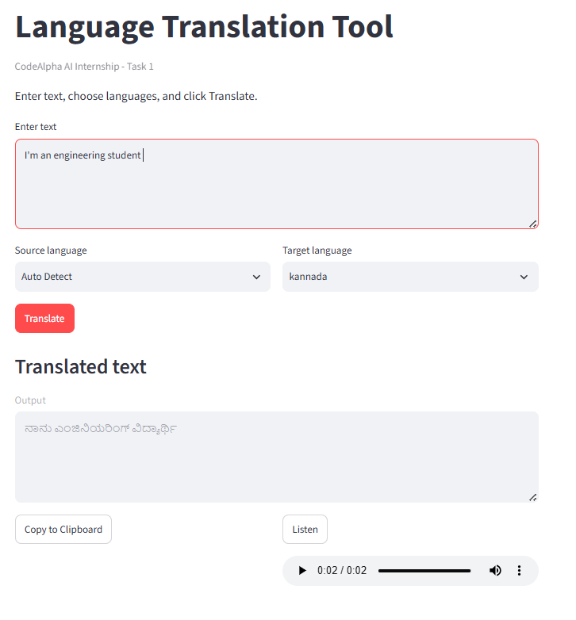

# CodeAlpha_LanguageTranslationTool

## 📌 Internship Task Overview
This project is submitted as part of the **CodeAlpha Artificial Intelligence Internship** (Task 1: Language Translation Tool).

It is a beginner-friendly Streamlit application that translates text between languages, supports **Auto Detect** for the source language, allows users to **copy translated output**, and includes **text-to-speech playback** for supported languages.

## 🎯 Task Objective
Build a Language Translation Tool that allows a user to:
- Enter text into a user interface.
- Select a **source language** and a **target language**.
- Send the input text to a translation API (Google Translate API or Microsoft Translator).
- Display the translated text clearly on the screen.
- (Optional) Add a copy-to-clipboard button or text-to-speech feature for improved usability.

## ✅ Task Requirements
| # | Requirement | Status |
|---|--------------|--------|
| 1 | User interface for text input | ✅ |
| 2 | Source & target language selection | ✅ |
| 3 | API integration for translation | ✅ |
| 4 | Display translated output | ✅ |
| 5 | (Optional) Copy button / Text-to-speech | ✅ |

## 🛠️ Tech Stack
- **Language:** Python
- **Translation Engine:** `deep-translator` (`GoogleTranslator`)
- **Interface:** Streamlit
- **Optional Utilities:** `gTTS` (text-to-speech), `pyperclip` (copy to clipboard)

## 🔗 Repository
- GitHub Repository: [CodeAlpha_LanguageTranslationTool](https://github.com/techWithKeerthana/CodeAlpha_LanguageTranslationTool)

## 📂 Project Structure
```
CodeAlpha_LanguageTranslationTool/
│
├── app.py                # Main application file
├── translator.py         # Translation logic (API calls)
├── requirements.txt      # Python dependencies
├── README.md             # Project documentation
└── screenshots/          # UI screenshots for demo
```

## ⚙️ Setup Instructions
1. Clone the repository:
   ```bash
   git clone https://github.com/techWithKeerthana/CodeAlpha_LanguageTranslationTool.git
   cd CodeAlpha_LanguageTranslationTool
   ```
2. Install dependencies:
   ```bash
   pip install -r requirements.txt
   ```
3. Run the application (exact command):
   ```bash
   streamlit run app.py
   ```

## ✨ Implemented Features
- Text input area for source content.
- Source language dropdown with **Auto Detect** support.
- Target language dropdown.
- Translation via `deep-translator` (`GoogleTranslator`) on **Translate** button click.
- Clear translated output display.
- **Copy to Clipboard** button for translated text.
- **Listen** (text-to-speech) button to generate and play translated speech using `gTTS`.
- **Swap** button to exchange source and target languages quickly.
- **Clear** button to reset input and output text.
- Character counters and clearer interface guidance.
- Basic error handling for:
   - Empty input text
   - Same source and target language selection
   - Unsupported language selections
   - Translation or network/API failures
   - Clipboard runtime issues
   - Unsupported text-to-speech language cases

## 🚀 How It Works
1. User enters text in the input box.
2. User selects the source language (or Auto Detect) and target language from dropdown menus.
3. On clicking "Translate," the text is sent to the translation API.
4. The translated text is received and displayed on the screen.
5. User can copy the translated text or listen to it via text-to-speech.

## 🖼️ Demo Screenshots
### App Screenshot


## 📹 Demo
A short video walkthrough of this project has been posted on LinkedIn, tagging **@CodeAlpha**.
🔗 [LinkedIn Video Link - add your post URL here](https://www.linkedin.com/)

## 📜 Internship Submission Checklist
- [x] Source code uploaded to GitHub as `CodeAlpha_LanguageTranslationTool`
- [ ] LinkedIn post with video explanation & GitHub link, tagging @CodeAlpha
- [ ] Task submitted via official Submission Form
- [ ] Internship status shared on LinkedIn

## 📞 Contact (CodeAlpha)
- Website: [www.codealpha.tech](http://www.codealpha.tech)
- Email: services@codealpha.tech / services.codealpha@gmail.com
- WhatsApp: +91 9336576683

---
*This project is developed as part of the CodeAlpha AI Internship Program.*
